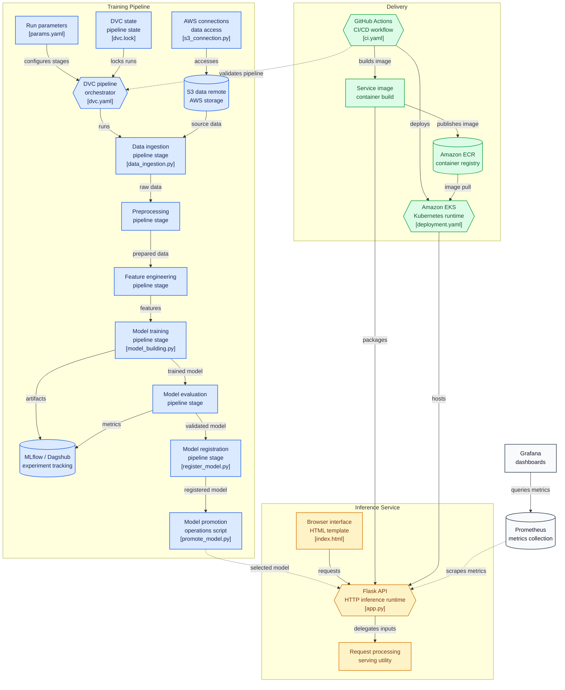

<div align="center">

# 🚀 End-to-End MLOps Capstone Project

### Production-Ready Machine Learning Pipeline with DVC • MLflow • Docker • GitHub Actions • AWS ECR • Amazon EKS • Prometheus • Grafana

<p align="center">


</p>

---

### ⚠️ Project Goal

> **This project focuses on implementing an industry-style MLOps workflow rather than building a highly accurate machine learning model.**

The primary objective is to demonstrate the complete operational lifecycle of an ML project, including:

**Experiment Tracking → Data Versioning → Automated Training → Model Registry → Docker → CI/CD → AWS ECR → Amazon EKS → Monitoring**

</div>

---

# 📌 Project Architecture

---


# ✨ Key Features

## 📦 Complete MLOps Pipeline

- Modular ML pipeline
- Automated preprocessing
- Feature engineering
- Model training
- Evaluation metrics
- Model registration
- Production inference API

---

## 📊 MLflow Experiment Tracking

✔ Track experiments

✔ Compare multiple runs

✔ Store metrics

✔ Store parameters

✔ Store artifacts

✔ Register best model

✔ Integrated with **Dagshub**

---

## 📂 Data Version Control (DVC)

- Data versioning
- Pipeline versioning
- Pipeline reproducibility
- Automatic dependency tracking
- S3 Remote Storage

Commands used:

```bash
dvc repro
dvc status
dvc push
```

---

## ☁️ AWS Cloud Integration

The project integrates multiple AWS services.

| Service    | Purpose               |
| ---------- | --------------------- |
| Amazon S3  | DVC Remote Storage    |
| Amazon ECR | Docker Image Registry |
| Amazon EKS | Kubernetes Deployment |
| IAM        | Authentication        |
| EC2        | Monitoring Servers    |

---

## 🐳 Dockerized Application

The Flask application is fully containerized.

Features:

- Lightweight image
- Production ready
- Environment variable support
- Easy deployment
- Portable runtime

---

## ⚙️ GitHub Actions CI/CD

Automatic pipeline executes on every push.

Pipeline includes:

- Checkout repository
- Setup Python
- Install dependencies
- Run tests
- Execute DVC pipeline
- Build Docker Image
- Push Docker Image to ECR
- Deploy to Amazon EKS

---

## ☸ Kubernetes Deployment (Amazon EKS)

Deployment features:

- Managed Kubernetes Cluster
- Replica management
- Rolling updates
- Service exposure
- LoadBalancer deployment
- Production-ready container orchestration

---

## 📈 Monitoring Stack

### Prometheus

Collects metrics from the Flask application.

Tracks:

- HTTP requests
- Request latency
- API health
- Custom application metrics

---

### Grafana

Beautiful dashboards for:

- Request statistics
- Traffic monitoring
- System health
- Live metrics visualization

---

# 🏗 Project Structure

```text
MLOPS-Capstone-Project/
│
├── .dvc/                          # DVC configuration for data version control
│   ├── .gitignore
│   └── config
│
├── .github/
│   └── workflows/
│       └── ci.yaml                # CI/CD pipeline configuration
│
├── docs/                          # Project documentation (Sphinx)
│   ├── Makefile
│   ├── commands.rst
│   ├── conf.py
│   ├── getting-started.rst
│   ├── index.rst
│   └── make.bat
│
├── flask_app/                     # Flask web application for model serving
│   ├── app.py
│   ├── load_model_test.py
│   ├── processing_utility.py
│   ├── requirements.txt
│   └── templates/
│       └── index.html
│
├── models/                        # Trained model artifacts
│   └── .gitkeep
│
├── notebooks/                     # Exploratory analysis & experiments
│   ├── IMDB.csv
│   ├── data.csv
│   ├── exp1.ipynb
│   ├── exp2_bow_vs_tfidf.py
│   └── exp3_lor_bow_hp.py
│
├── references/                    # Data dictionaries, manuals, reference material
│   └── .gitkeep
│
├── reports/                       # Generated analysis reports
│   ├── .gitignore
│   ├── .gitkeep
│   └── figures/
│       └── .gitkeep
│
├── scripts/
│   └── promote_model.py           # Model promotion utility
│
├── src/                           # Source code for use in this project
│   ├── __init__.py
│   │
│   ├── connections/                # External service connections
│   │   ├── __init__.py
│   │   ├── config.json
│   │   ├── s3_connection.py
│   │   └── ssms_connection.py
│   │
│   ├── data/                       # Data ingestion & preprocessing
│   │   ├── .gitkeep
│   │   ├── __init__.py
│   │   ├── data_ingestion.py
│   │   └── data_preprocessing.py
│   │
│   ├── features/                   # Feature engineering
│   │   ├── .gitkeep
│   │   ├── __init__.py
│   │   └── feature_engineering.py
│   │
│   ├── logger/                     # Logging utility
│   │   └── __init__.py
│   │
│   ├── model/                      # Model building, evaluation & registration
│   │   ├── .gitkeep
│   │   ├── __init__.py
│   │   ├── model_building.py
│   │   ├── model_evaluation.py
│   │   └── register_model.py
│   │
│   └── visualization/              # Visualization utilities
│       ├── .gitkeep
│       ├── __init__.py
│       └── visualize.py
│
├── tests/                         # Unit & integration tests
│   ├── test_flask_app.py
│   └── test_model.py
│
├── .dvcignore
├── .gitignore
├── Dockerfile                     # Container image definition
├── LICENSE
├── Makefile                       # Convenience commands (setup, train, etc.)
├── README.md
├── deployment.yaml                # Kubernetes deployment manifest
├── dvc.lock                       # DVC pipeline lock file
├── dvc.yaml                       # DVC pipeline stages
├── params.yaml                    # Pipeline hyperparameters/config
├── requirements.txt                # Project dependencies
├── setup.py                        # Package setup
├── test_environment.py            # Environment sanity check
└── tox.ini                        # Test automation config
```

---

# 🛠 Tech Stack

## Machine Learning

- Python
- Scikit-Learn
- Pandas
- NumPy

---

## Experiment Tracking

- MLflow
- Dagshub

---

## Data Versioning

- DVC
- Amazon S3

---

## Backend

- Flask

---

## Containerization

- Docker

---

## CI/CD

- GitHub Actions

---

## Cloud

- AWS IAM
- AWS S3
- AWS ECR
- AWS EKS
- EC2

---

## Monitoring

- Prometheus
- Grafana

---

# 🚀 CI/CD Pipeline

```text
Push Code
     │
     ▼
GitHub Actions
     │
     ▼
Run Unit Tests
     │
     ▼
Build Docker Image
     │
     ▼
Push Image to AWS ECR
     │
     ▼
Deploy to Amazon EKS
     │
     ▼
Application Live
```

---

# 📊 Monitoring Pipeline

```text
Flask API
     │
     ▼
Prometheus Metrics
     │
     ▼
Grafana Dashboards
```

# ⚡ Local Setup

Clone repository

```bash
git clone https://github.com/yourusername/project.git
```

Create environment

```bash
conda create -n atlas python=3.10
conda activate atlas
```

Install dependencies

```bash
pip install -r requirements.txt
```

Run pipeline

```bash
dvc repro
```

Run application

```bash
python flask_app/app.py
```

---

# 📦 Deployment Stack

| Stage               | Tool       |
| ------------------- | ---------- |
| Version Control     | Git        |
| Experiment Tracking | MLflow     |
| Data Versioning     | DVC        |
| Remote Storage      | Amazon S3  |
| Containerization    | Docker     |
| Registry            | Amazon ECR |
| Orchestration       | Amazon EKS |
| Monitoring          | Prometheus |
| Dashboard           | Grafana    |

---

# 🎯 Learning Outcomes

This project demonstrates practical knowledge of:

- Building modular ML pipelines
- Experiment tracking with MLflow
- Data versioning using DVC
- Reproducible ML workflows
- Docker containerization
- GitHub Actions automation
- AWS cloud deployment
- Kubernetes fundamentals
- Production model deployment
- Monitoring ML applications
- Infrastructure automation

---

# 📚 Future Improvements

- Model retraining pipeline
- Hyperparameter optimization
- Canary deployments
- Blue-Green deployment
- Helm Charts
- Terraform Infrastructure
- ArgoCD GitOps
- Autoscaling
- Logging with ELK Stack
- AlertManager integration

---

# 🤝 Contributing

Contributions, issues and feature requests are welcome!

Feel free to fork the repository and submit a Pull Request.

---

# ⭐ If you found this project useful

Please consider giving the repository a ⭐

It motivates me to build more production-grade Machine Learning and MLOps projects.

---

<div align="center">

### Built with ❤️ to learn Production MLOps Engineering

**From Model Training → Cloud Deployment → Monitoring**

</div>
